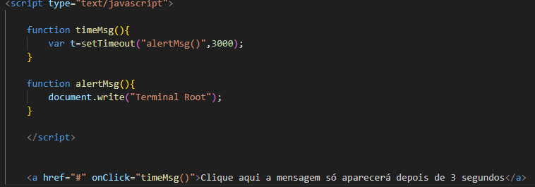

# Objetivo
 Nosso objetivo era selecionar dois codigos em JavaScript e entendermos ele, para podermos explicar suas funcionalidades.

 # Código 1

 
  ## Funcionalidade
   Esse código abre um Pop-Up no Centro da Página

## Como funciona
A função NovaJanela é definida, aceitando cinco parâmetros: pagina, nome, w, h e scroll.

pagina: A URL da página que será aberta na nova janela.
nome: O nome da janela.
w: A largura da janela em pixels.
h: A altura da janela em pixels.
scroll: Uma string indicando se as barras de rolagem devem ser mostradas na nova janela. Pode ser "yes" para mostrar barras de rolagem ou "no" para ocultá-las.

# Código 2 

## Funcionalidade
Esse código faz com que após 3 segundos que você apertou o botão apareça uma mensagem na tela.

## Como funciona 

Esse código JavaScript cria uma função timeMsg() que define um temporizador usando setTimeout() para chamar outra função chamada alertMsg() após um atraso de 3000 milissegundos (3 segundos).

A função alertMsg() é responsável por escrever "Terminal Root" no documento usando document.write().

No HTML, há um link com o atributo onClick que chama a função timeMsg() quando clicado. Isso significa que quando o link é clicado, ele aciona o temporizador definido em timeMsg(), que depois de 3 segundos chama a função alertMsg() para escrever "Terminal Root" no documento.

Então, basicamente, quando você clica no link, uma mensagem "Terminal Root" é exibida no documento após um atraso de 3 segundos.

# Tecnologias ultilizadas
* Github
* VS Studio Code
* HTML 5
* CSS3

# Autores
* Ricardo Siena